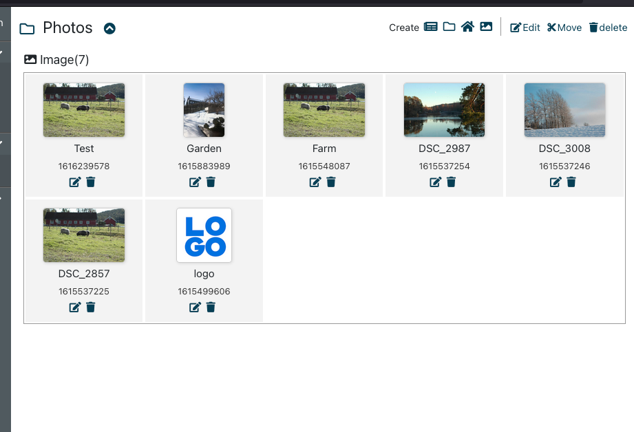
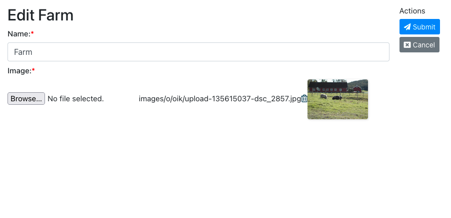

<details open markdown="block">
  <summary>
    Template
  </summary>
  {: .text-delta }
1. TOC
{:toc}
</details>

## Basic concepts

### Location content and non-location content
Digimaker has 2 types of content: 

1) content which has a location, eg. article, news, blog. Those contents may need location to identify where they are, a unique id(locaiton id), and may have multiple locations for one content(eg.article).

2) content which doesn't have a location, eg. image, video, customzied content like certificates. They don't need location to identify themself, and they are very close to a normal database table.


So digimaker provides apis and features(in admin) to manage both types of content, eg. query, add, update, delete, set permissions.


### What's the difference between using non-location content and normal database table/entity&ORM? 

Well in principle they are almost doing the same thing. You can use our api to manipulate those data, or use own api with own ORM, or both ways(mix our api with own ORM). 

Some benefit of using CMF's content model instead of pure entity:

- it provides some features already so you don't need to do duplicated work on almost same feature on different entities 
- the content model is dynamic so you can set value to a field dynamically. For instance, in example below, if you add more attributes(eg. category or place) to image it will be automatically in the edit interface and rest api without any coding. 






However, for many customized features it will be more flexiable to have own api/ORM since ORM way is more powerful, eg. when there are lots of join in query, multiple tables update in business logic.


### How is data manipulated
It's very similar to a typical mvc system.

- Model - based on content definition(under configs/contenttype.json), we generate a model layer(under entity)
- Business logic - we have business logic related to content and provide Go api
- Controller - we have rest api and html rendering for controller
- View - for website we provide template for rendering, or rest api for query

Below is an example of content definition(see [contenttype.json reference](../references/contenttype) for more). It generates a go struct like [this](https://github.com/digimakergo/dmdemo/blob/master/entity/article.go), so every time when there is model change, you need to update entities, and update database(use our generated sql or manually change database)..
```json
"article": {
    "Name": "Article",
    "table_name": "dm_article",
    "has_version": true,
    "has_location": true,
    "name_pattern": "{title}",
    "fields": [{
        "identifier": "title",
        "type": "text",
        "name": "Title",
        "parameters": {
          "max_length": 300
        },
        "required": true
      },     
      {
        "identifier": "coverimage",
        "type": "image",
        "name": "Cover image",
        "required": false
      },
      {
        "identifier": "summary",
        "type": "richtext",
        "name": "Summary",
        "required": false,
        "parameters": {
          "mode":"compact"
        }
      },
 ```

