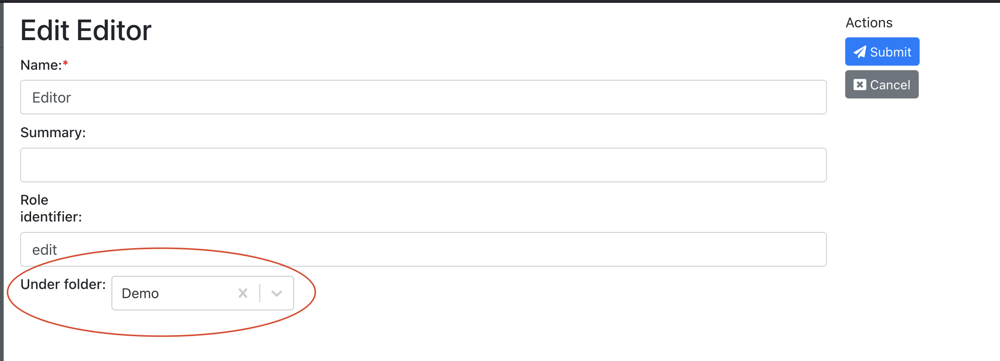

# Permisssion
Permission system of digimaker is essential to data management. The principle is to have the power of access control, at same time make it easy for developers to develop, maintain.

Highlights:
- Define permission rules in json file(configs/policies.json)
- Support attribute-level permission, eg. some user can only create/update some fields
- Support custom variables in role, which are role content fields
- Can debug permission

Main concepts:
- Role, which can be assigned to a user, and include policies
- Policy, which defined a set of accesses


## Policy example
Below is a policies example, under configs/policies.json:
```json
  {
    "operation": ["content/read", "content/create"],
    "limited_to": {
      "contenttype": ["article"]
    }
  }
```

## Role variables
Since role is a content, it's fields can be extended. It's possible to use role's field value as 'variable' in policies. This is useful for example multi-site editors, members, temporary access.



In screenshot above, we set a role's "under folder" to be "Demo" folder. In the poclies if we have policy like below, users assgned to the editor role will be limited to read content under "demo". 
```json
{
  "operation": ["content/read"],
  "limited_to": {
    "under":"{under_folder}"
  }
}
```

## Typical permissions
Typical permission are like
 - fetching  based on content type, parent,etc
 - operations(eg. create content, update, delete) based on content type, parent, author(self)
 - updated fields when updating - attribute level permission
 - non-content operation like login, left menu of eui, etc


## Refererances
 [policies.json](https://digimaker.org/doc/references/policies)
